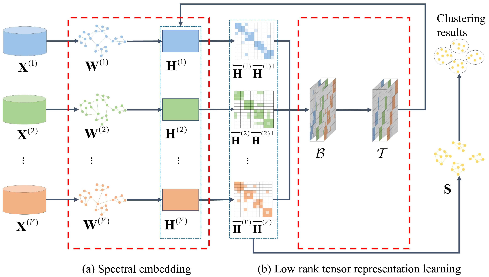

# 
`Consensus Graph Learning for Multi-view Clustering (IEEE TMM 2021)`

> **Authors:**
Zhenglai Li, Chang Tang, Xinwang Liu, Xiao Zheng, Guanghui Yue, Wei Zhang, En Zhu

This repository contains simple Matlab and Python implementations of our paper [CGL](https://ieeexplore.ieee.org/abstract/document/9437715).

### 1. Overview

      

Framework of the proposed CGL method. Multi-view similarity graphs $\{\mathbf{W}^{(v)}\}_{v=1}^V$ are generated from multi-view data $\{\mathbf{X}^{(v)}\}_{v=1}^V$ in advance. Multi-view embedded representations \textcolor[rgb]{0,0,1}{$\{\mathbf{H}^{(v)}\}_{v=1}^V$} are obtained via (a) spectral embedding. To effectively capture the global consistency among multiple views, a low rank tensor $\mathcal{T}$ is learned from a corrupted tensor $\mathcal{B}$, which is constructed by stacking the inner product of normalized embedded representations $\{ \bar{\mathbf{H}}^{(v)}\bar{\mathbf{H}}^{(v)\top}\}_{v = 1}^V$ into a third-order tensor form. We further integrate the (a) spectral embedding and (b) low rank tensor representation learning into a unified optimization framework to achieve mutual promotion. Finally, the consensus graph $\mathbf{S}$ can be learned in the embedded space.  

### 2. Usage
+ Prepare the data:
    - The ORL dataset can be downloaded from [Google_Drive](https://drive.google.com/file/d/1f971hInoEvA_uM8iNwMCc2-qGeTrYX2d/view?usp=sharing). 
    - The other datasts can be downloaded from [BaiduYun](https://pan.baidu.com/s/1FSSzkbA8KqCxaktfv6atww)(s3u3).

+ Prerequisites for Python:
    - Creating a virtual environment in terminal: `conda create -n CGL python=3.9`
    - Installing necessary packages: `pip install -r requirements.txt `

+ Prerequisites for Matlab:
    - Test on Matlab R2018a

+ Conduct clustering

### 3. Citation

Please cite our paper if you find the work useful:

    @article{Li_2021_CGL,
        author={Li, Zhenglai and Tang, Chang and Liu, Xinwang and Zheng, Xiao and Zhang, Wei and Zhu, En},
        journal={IEEE Transactions on Multimedia}, 
        title={Consensus Graph Learning for Multi-View Clustering}, 
        year={2022},
        volume={24},
        number={},
        pages={2461-2472},
        doi={10.1109/TMM.2021.3081930}
        }